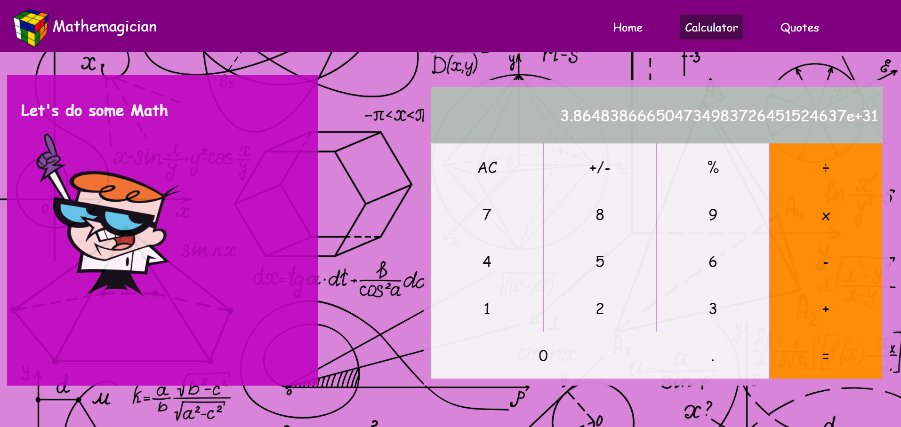

# Mathemagician | M3Wx

> "Mathemagician" is a web app for all fans of mathematics. It is a Single Page App (SPA) that allows users to make simple calculations and read a random math-related quote.



Our goal here is to Build a single page web application for mathematics weebs using the React library

## Live Demo
Click [here](https://harlexkhal.github.io/Mathemagician/) to view live demo

### Features implemented so far are:

- Project Setup with React Installations
- Calculator with (Add, Minus, Multiply, and Division) Features
- Page for Mathematics Quotes
- Home page that gives information about the history of mathematics

## Built With

- React (A free and open-source front-end JavaScript library for building user interfaces based on UI components)
- React Testing Library
- React Router
- Stylelint (A mighty, modern linter that helps you avoid errors and enforce conventions in your styles).
- ESlint (A mighty, modern linter that helps you avoid errors and enforce conventions in JavaScript codes)

To get a local copy up and running follow these simple example steps.

### Prerequisites

The basic requirements for building the executable are:

- A working browser application (Google chrome, Mozilla Fire fox, Microsoft edge ...)
- VSCode or any other equivalent code editor
- Node Package Manager (For installing packages like Lighthous, webhint & stylelint used for checking for debugging bad codes before deployment)

# Getting Started

#### Cloning the project

```
git clone  https://github.com/harlexkhal/Mathemagician <Your-Build-Directory>
```

## Getting packages and dependencies
To get all package modules required to build the project run:
```
npm install
```
every package module required to build the project is listed in the package.json file. this is used as a reference to get all dependencies.

## Building 

To build the project run:
```
npm run build
```
after you run this sucessfully you'd locate the build from in the ```build``` folder located from the parent directory of the project.

## Running

To run the program on a browser through a server run this command in your cli
```
npm start
```
This should open the page in your localhost on port 3000. then you'd be able to view the built page generated using webpack.

## Unit-Testing

You can find all of the unit test for testing all components in the ```src/__Test__``` folder located in the parent source directory of the project. you can create your own custom unit test and test it by running
```
npm run test
```
This should run all unit test found in the ```src/__Test__```

## License

All source code files are licensed under the permissive zlib license
(http://opensource.org/licenses/Zlib) unless marked differently in a particular folder/file.

## Author
- **Alexander Oguzie-Ibeh** - [github](https://github.com/harlexkhal), [linkedin](https://www.linkedin.com/in/alexander-oguzie-ibeh-776814164), [twitter](https://twitter.com/harlexkhal)
